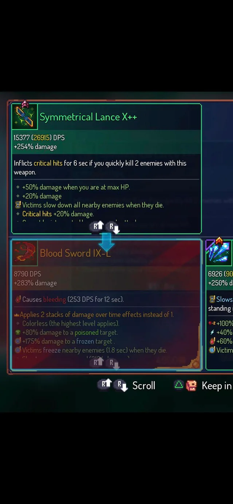

# An Easy Way to find wich weapon is better (in terms of damage)

This is a code I made with the intention of making things easier; it was one of my first codes.
 
Dead-Cells' gameplay frequently involves finding different weapons with various attributes such as Base Damage, Additional Damage, and Additional Damage Percentage. This code is mainly used in conjunction with the game to enhance the experience.

                          

 

# Uma forma mais fácil de descobrir qual das armas é melhor (em questão de dano)
Esse é um código que eu fiz com a intenção de facilitar algo, foi um dos meus primeiros códigos.
 
A gameplay de Dead-Cells faz com que frequentemente encontre armas diferentes com diversos atributos como Dano Base, Dano Adicional e Percentual adicional de dano, esse código serve principipalmente para ser utilizado junto do jogo para melhorar a experência.

                          